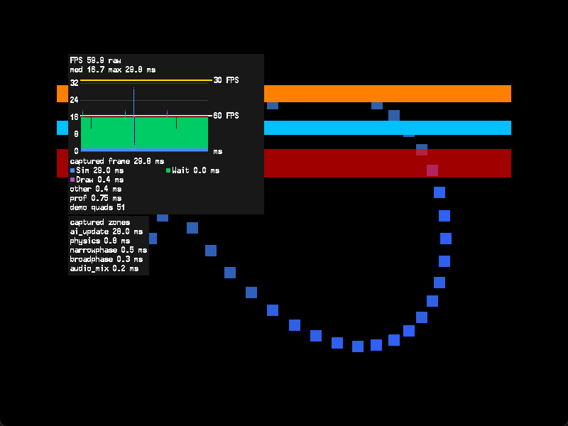

# visprof

An visual on-screen frame profiler for Dreamcast applications using KallistiOS.<br>
Supports C99 with GNU extensions and C++11 or later.



## Build

```sh
source /opt/toolchains/dc/kos/environ.sh
make
```

Add `-I<libvisprof>/include` to your compiler flags and
`<libvisprof>/libvisprof.a` to your link command. <br>
The library depends on KOS and libc.

```sh
make -C examples/basic    # basic demo
make -C examples/2ndmix   # instrumented 2ndmix KOS sample
make check                # host tests and KOS build checks
make clean                # remove all library and example build outputs
```

`make check` also needs native GCC. The [2ndmix
example](examples/2ndmix/README.md) uses source and assets from your KOS
installation. <br>
Both demos have been checked on Dreamcast hardware and in Flycast.

## Usage

Initialize after PVR setup. Register phases for parts of the frame and use
`VISPROF_SCOPE` to time individual functions or blocks. <br>
This example assumes `update()` and `draw_scene()` belong to your application:

```c
#include <kos.h>
#include <visprof/visprof.h>

/* After PVR initialization, in your application's main function. */
visprof_init(NULL);
visprof_phase_t update_phase = visprof_phase_register("Update", 0);
visprof_set_visible(1);

for (;;) {
    visprof_frame_begin();
    visprof_phase_begin(update_phase);
    {
        VISPROF_SCOPE("update");
        update();
    }
    visprof_phase_end(update_phase);

    pvr_wait_ready();
    pvr_scene_begin();
    pvr_list_begin(PVR_LIST_TR_POLY);
    draw_scene();
    visprof_draw();
    pvr_list_finish();
    pvr_scene_finish();
    visprof_frame_end();
}
```

- Draw in the open translucent list using direct rendering, after your scene.<br><br>
- Use `pvr_init_defaults()` or provide translucent bins and enough polygon-list
  overflow space. <br>
  Both examples set `opb_overflow_count = 3`. Insufficient space causes missing geometry / tiling glitches on hardware! <br><br>
- Keep scene depths below `1.00e9`, where the overlay begins.<br><br>
- Call the profiler from one frame thread. Phases must not overlap. End every
  scope before `visprof_frame_end()`.<br><br>
- Keep registered names and counter storage valid until shutdown. <br>
  Wait for pending PVR work to finish before calling `visprof_shutdown()`.

The [basic demo](examples/basic/main.c) shows phases, counters and controls.
Each function is documented in the [public header](include/visprof/visprof.h).

## Reading the overlay

- Times are elapsed wall time, including waits. <br><br>
- `raw` includes profiler overhead. <br><br>
- `adjusted` subtracts measured profiler overhead from frame and phase times. <br><br>
- Zones always include child zones. Neither mode measures GPU execution time. <br><br>
- FPS uses actual elapsed time in both modes. <br><br>
- `med` and `max` describe the frame history. <br><br>
- The captured phase and zone timings belong to one retained frame, which can differ from the history maximum. <br><br>
- Counters and `prof` show values from the last completed frame. <br><br>

The library supports four phases, 32 zones per frame and 16 application
counters. Its font atlas uses 64 KiB of video memory.

See the [reference](docs/reference.md) for configuration, display labels,
capture rules, rendering requirements and alternative build methods.

## Disable visprof

Build the library and your application with `VISPROF_ENABLED=0` to compile out
profiling. The setting must match in both:

```sh
make VISPROF_ENABLED=0
```

## License

[MIT](LICENSE) <br><br>
See [third-party notices](THIRD-PARTY.md) for KOS and [CONTRIBUTING.md](CONTRIBUTING.md) for development checks.

## 🤖 Note on AI Usage
Visprof was developed with the assistance of Codex Astra (via ChatGPT). <br>
All AI-generated code, algorithms, and structures have been manually reviewed and tested!
