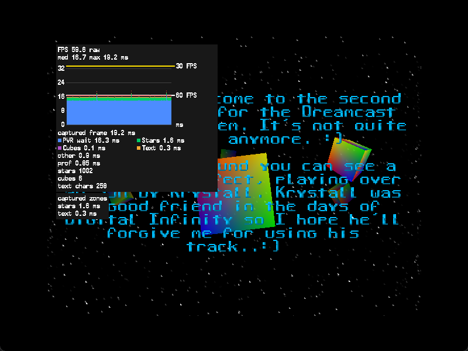

# KOS 2ndmix with libvisprof

This example adds timing to KOS's 2ndmix starfield, cubes and text display. The
original music still runs on the Dreamcast's AICA sound processor.

## Build and run

```sh
source /opt/toolchains/dc/kos/environ.sh
cd examples/2ndmix
make -j2
```

Open `2ndmix-profiler.elf` in Flycast or load it through your Dreamcast
loader. The ELF includes the original music in a ROM disk, so the sample needs
no external runtime files.

The Makefile reads the source, font, sound player and music from
`$KOS_BASE/examples/dreamcast/2ndmix`. It applies `profiler.patch` to a locally
generated `2ndmix.c`. Your KOS checkout stays untouched. GNU patch is
required. If the installed KOS sample changes, the patch may fail and need
updating before the build can finish.

For the original sample without instrumentation:

```sh
make baseline
```

This produces `2ndmix-baseline.elf` from the installed KOS source.

`make VISPROF_ENABLED=0` builds the instrumented source with the profiler
compiled out. `make VISPROF_ENABLED=1` restores it. These builds use the same
library archive as the other libvisprof examples. The counter increments
remain in the disabled instrumented source. Use the baseline for the
unmodified sample.

## Controls

| Dreamcast button | Action |
|---|---|
| A | Show or hide the overlay |
| B | Switch raw and adjusted timing |
| D-pad right | Cycle overlay positions |
| Start | Exit, as in the original sample |

## Measurements

| Phase | Work measured |
|---|---|
| PVR wait | Scene setup and opening the first polygon list, including KOS waiting for the tile accelerator. |
| Stars | Star movement, projection, visibility checks and triangle submission |
| Cubes | Cube animation, transforms and translucent geometry submission |
| Text | Text animation and textured character submission |

The stars, cubes and text phases also have scoped zones. Zone entries below
0.1 ms are omitted by the profiler. A phase can therefore show a value when
its corresponding zone is absent.

`stars` counts submitted star triangles, not all allocated stars. `cubes`
counts cubes that pass the sample's size check, not cube faces or triangles.
`text chars` counts submitted characters, excluding spaces and unsupported
characters. These counters describe the last completed frame. Captured phase
and zone timings both describe the retained frame.

The overlay is submitted after the original text in the translucent list. The
original geometry, animation and music paths stay unchanged. The PVR
configuration reserves three extra polygon-list buffers for the overlay. Input
and list transitions outside the four phases appear in `other`. PVR wait is
elapsed waiting time, not GPU execution time. The profiler measures elapsed
time on the SH4. It does not measure execution time on the AICA.

## Verification

Rendering, music and controls passed Flycast and Dreamcast hardware checks on
2026-09-10. Enabled and disabled builds passed. The disabled ELF contains no
profiler implementation symbols. Hardware performance still needs an isolated
benchmark.



## Source and notices

The sample is by Megan Potter and comes from KallistiOS. Its existing
attribution remains in the generated source. The patch and Makefile add the
profiler integration. Original source, music, font and sound player data are
read from the local KOS installation and are not copied into this example's
tracked files. See [KOS notices](../../THIRD-PARTY.md) and the notices in your
KOS version before distributing a built sample.
